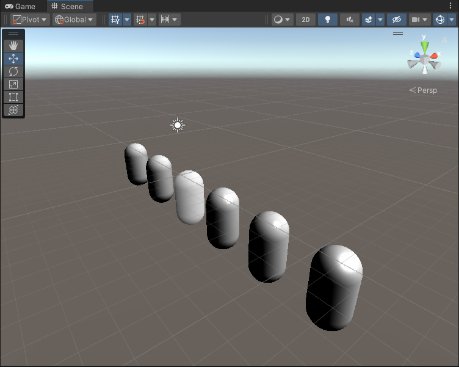

# Unity Shaders Book
### [章节6(标准光照模型)](Chapter%206)
1.  [逐顶点Lambert](Chapter%206/Diffuse/Chapter6-DiffuseVertexLevel.shader)
2.  [逐像素Lambert](Chapter%206/Diffuse/Chapter6-DiffusePixelLevel.shader)
3.  [HalfLambert](Chapter%206/Diffuse/Chapter6-HalfLambert.shader)
4.  [逐顶点Specular](Chapter%206/Specular/Chapter6-SpecularVertexLevel.shader)
5.  [逐像素Specular](Chapter%206/Specular/Chapter6-SpecularPixelLevel.shader)
6.  [BlinnPhong](Chapter%206/Specular/Chapter6-BlinnPhong.shader)

---

### [章节7(单张纹理)](Chapter%207) (图片出处[freepbr](https://freepbr.com/product/damp-block-wall-pbr/))
1.  [单张纹理](Chapter%207/Chapter7-SingleTexture.shader)
2.  [切线空间-法线纹理](Chapter%207/Chapter7-NormalMapTangentSpace.shader)
3.  [世界空间-法线纹理](Chapter%207/Chapter7-NormalMapWorldSpace.shader)
4.  [渐变纹理](Chapter%207/Chapter7-RampTexture.shader)
5.  [遮罩纹理](Chapter%207/Chapter7-MaskTexture.shader)

---

### [章节8(透明纹理)](Chapter%208)
1.  [Alpha Test](Chapter%208/Chapter8-AlphaTest.shader)
2.  [Alpha Blend (ZWrite Off SrcAlpha OneMinusSrcAlpha)](Chapter%208/Chapter8-AlphaBlend.shader)
3.  [Alpha Blend (ZWrite On SrcAlpha OneMinusSrcAlpha)](Chapter%208/Chapter8-AlphaBlendZWrite.shader)
4.  [Alpha Test Both Sided](Chapter%208/Chapter8-AlphaTestBothSided.shader)
5.  [Alpha Blend Both Sided(ZWrite Off SrcAlpha OneMinusSrcAlpha)](Chapter%208/Chapter8-AlphaBlendBothSided.shader)

---

### [章节9(多光源)](Chapter%209)
1. [Multi Light](Chapter%209/Chapter9-ForwardRendering.shader)
2. [Shadow](Chapter%209/Chapter9-Shadow.shader)

### [章节10(高级纹理)](Chapter%2010)
1. [Reflection](Chapter%2010/Chapter10-Reflection.shader)
2. [Refraction(Opaque Texture)](Chapter%2010/Chapter10-Refraction-Opaque.shader)
3. [Refraction(Cube)](Chapter%2010/Chapter10-Refraction.shader)
3. [Reflection(Fresnel)](Chapter%2010/Chapter10-Fresnel.shader)

### [章节11(纹理动画)](Chapter%2011)
1. [Image Sequence Animation](Chapter%2011/Chapter11-ImageSequenceAnimation.shader)
2. [Scrolling Background](Chapter%2011/Chapter11-ScrollingBackground.shader)
2. [2D Water](Chapter%2011/Chapter11-Water2D.shader)

