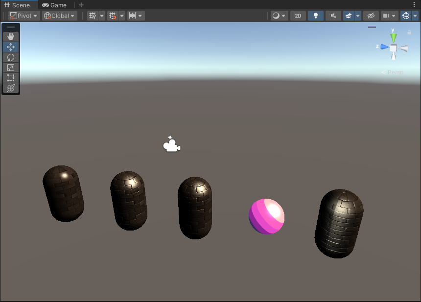

# Shader-Study-Journey
目前主要是在学习Unity shader入门精要时，对相应的shader实现更改为urp实现。学习shader的同时，也顺便熟悉urp相关

---

## Unity Shaders Book
### [章节6(标准光照模型)](Assets/Unity%20Shaders%20Book/Chapter%206)
1.  [逐顶点Lambert](Assets/Unity%20Shaders%20Book/Chapter%206/Diffuse/Chapter6-DiffuseVertexLevel.shader)
2.  [逐像素Lambert](Assets/Unity%20Shaders%20Book/Chapter%206/Diffuse/Chapter6-DiffusePixelLevel.shader)
3.  [HalfLambert](Assets/Unity%20Shaders%20Book/Chapter%206/Diffuse/Chapter6-HalfLambert.shader)
4.  [逐顶点Specular](Assets/Unity%20Shaders%20Book/Chapter%206/Specular/Chapter6-SpecularVertexLevel.shader)
5.  [逐像素Specular](Assets/Unity%20Shaders%20Book/Chapter%206/Specular/Chapter6-SpecularPixelLevel.shader)
6.  [BlinnPhong](Assets/Unity%20Shaders%20Book/Chapter%206/Specular/Chapter6-BlinnPhong.shader)

---
### [章节7(单张纹理)](Assets/Unity%20Shaders%20Book/Chapter%207)
1.  [单张纹理](Assets/Unity%20Shaders%20Book/Chapter%207/Chapter7-SingleTexture.shader)(图片出处[freepbr](https://freepbr.com/product/damp-block-wall-pbr/))

