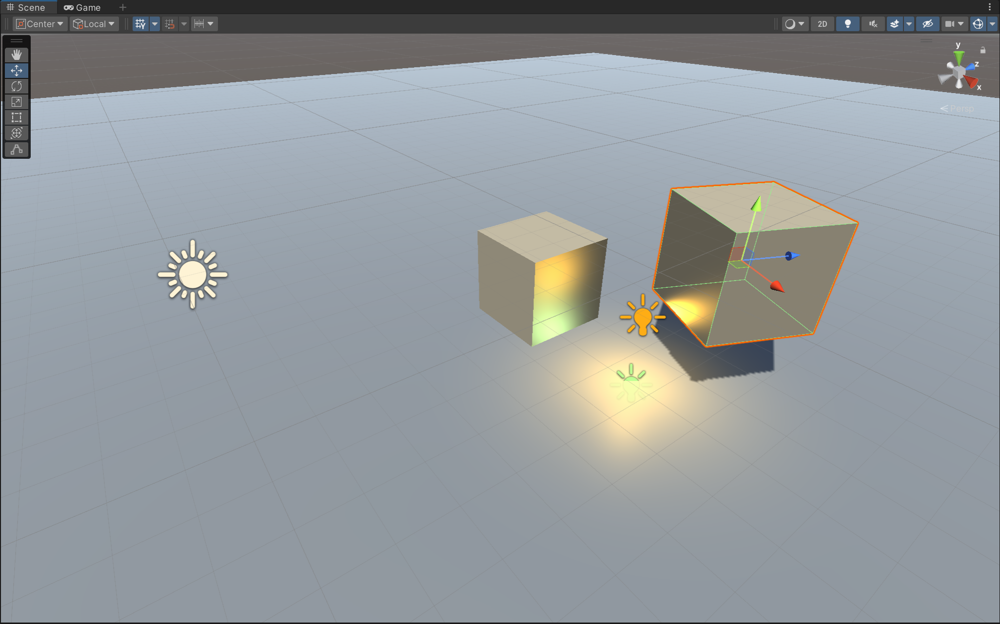
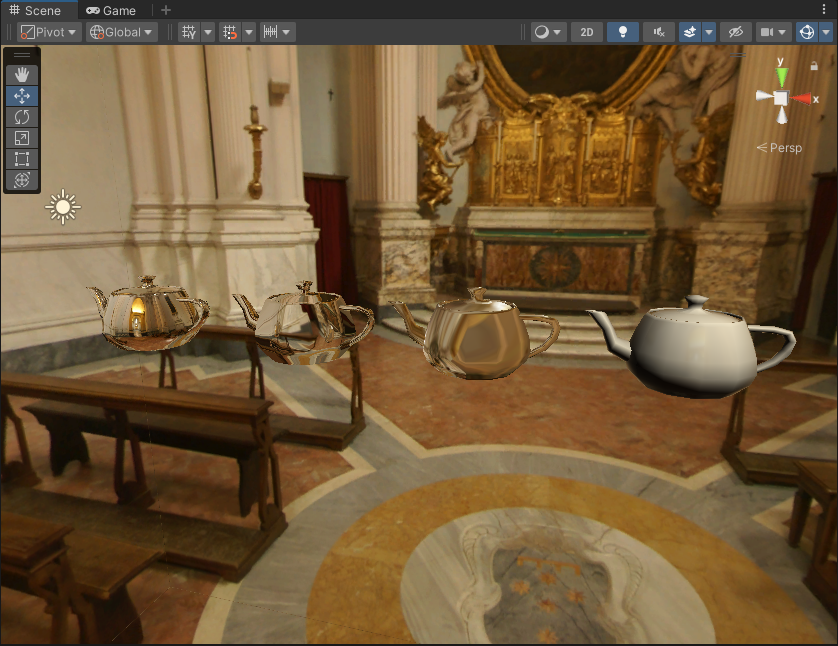

# Shader-Study-Journey
目前主要是在学习《Unity Shader入门精要》时，对相应的shader实现更改为urp实现。学习shader的同时，也顺便熟悉urp相关

---

## Unity Shaders Book
### [章节6(标准光照模型)](Assets/Unity%20Shaders%20Book/Chapter%206)
1.  [逐顶点Lambert](Assets/Unity%20Shaders%20Book/Chapter%206/Diffuse/Chapter6-DiffuseVertexLevel.shader)
2.  [逐像素Lambert](Assets/Unity%20Shaders%20Book/Chapter%206/Diffuse/Chapter6-DiffusePixelLevel.shader)
3.  [HalfLambert](Assets/Unity%20Shaders%20Book/Chapter%206/Diffuse/Chapter6-HalfLambert.shader)
4.  [逐顶点Specular](Assets/Unity%20Shaders%20Book/Chapter%206/Specular/Chapter6-SpecularVertexLevel.shader)
5.  [逐像素Specular](Assets/Unity%20Shaders%20Book/Chapter%206/Specular/Chapter6-SpecularPixelLevel.shader)
6.  [BlinnPhong](Assets/Unity%20Shaders%20Book/Chapter%206/Specular/Chapter6-BlinnPhong.shader)

---

### [章节7(单张纹理)](Assets/Unity%20Shaders%20Book/Chapter%207) (图片出处[freepbr](https://freepbr.com/product/damp-block-wall-pbr/))
1.  [单张纹理](Assets/Unity%20Shaders%20Book/Chapter%207/Chapter7-SingleTexture.shader)
2.  [切线空间-法线纹理](Assets/Unity%20Shaders%20Book/Chapter%207/Chapter7-NormalMapTangentSpace.shader)
3.  [世界空间-法线纹理](Assets/Unity%20Shaders%20Book/Chapter%207/Chapter7-NormalMapWorldSpace.shader)
4.  [渐变纹理](Assets/Unity%20Shaders%20Book/Chapter%207/Chapter7-RampTexture.shader)
5.  [遮罩纹理](Assets/Unity%20Shaders%20Book/Chapter%207/Chapter7-MaskTexture.shader)

---

### [章节8(透明纹理)](Assets/Unity%20Shaders%20Book/Chapter%208)
1.  [Alpha Test](Assets/Unity%20Shaders%20Book/Chapter%208/Chapter8-AlphaTest.shader)
2.  [Alpha Blend (ZWrite Off SrcAlpha OneMinusSrcAlpha)](Assets/Unity%20Shaders%20Book/Chapter%208/Chapter8-AlphaBlend.shader)
3.  [Alpha Blend (ZWrite On SrcAlpha OneMinusSrcAlpha)](Assets/Unity%20Shaders%20Book/Chapter%208/Chapter8-AlphaBlendZWrite.shader)
4.  [Alpha Test Both Sided](Assets/Unity%20Shaders%20Book/Chapter%208/Chapter8-AlphaTestBothSided.shader)
5.  [Alpha Blend Both Sided(ZWrite Off SrcAlpha OneMinusSrcAlpha)](Assets/Unity%20Shaders%20Book/Chapter%208/Chapter8-AlphaBlendBothSided.shader)

---

### [章节9(多光源)](Assets/Unity%20Shaders%20Book/Chapter%209)
1. [Multi Light](Assets/Unity%20Shaders%20Book/Chapter%209/Chapter9-ForwardRendering.shader)
2. [Shadow](Assets/Unity%20Shaders%20Book/Chapter%209/Chapter9-Shadow.shader)

### [章节10(高级纹理)](Assets/Unity%20Shaders%20Book/Chapter%2010)
1. [Reflection(Cube)](Assets/Unity%20Shaders%20Book/Chapter%2010/Chapter10-Reflection.shader)

